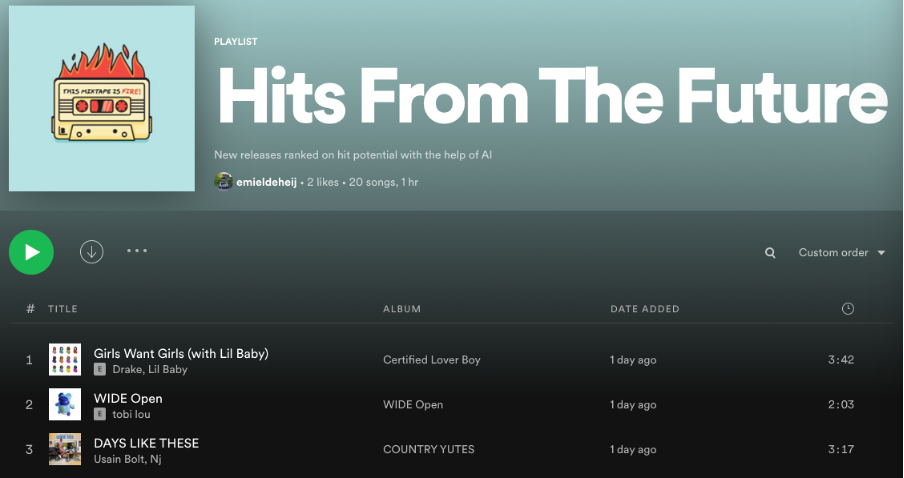
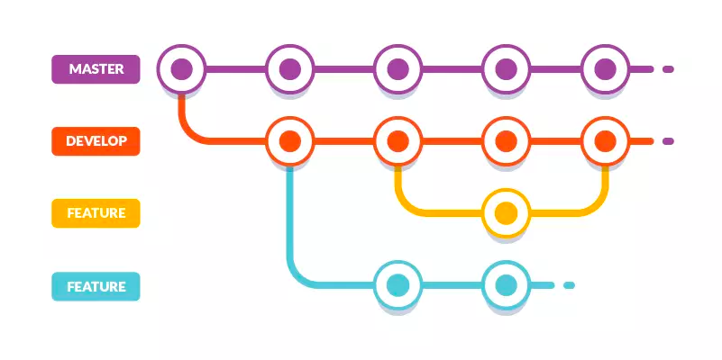

spotifAI
==============================
With SpotifAI, we provide you with a playlist of new music before it will become mainstream!
Using machine learning, we are ranking new releases based on their hit potential. 
Every friday at 12.00 CET the playlist refreshes with the top 20 of most promising tracks that were released in the past week.

Find our playlist and give it a like [here](https://open.spotify.com/playlist/7oCxRqjtXpt5rwwY6nOK4m?si=869ace0ae4af4364)!

Git branching strategy & pull requests
------------

For every feature, a separate branch is created from the development branch. 
The naming convention for feature branches is: 

    <Jira_issue_id>-<small-description> (e.g. spot-2-EDA-spotify-API)

To create a new branch and switch to your new branch, from the development branch, run the following in your terminal:

    git checkout -b <branch_name>

Now, you can start developing your feature. During developing, try to keep your commits coherent and avoid commits with many changes in many different files to keep it manageable to review your changes. 
Do not use 'git add .', but add your changes individually or use this command to go through them one by one and accept or reject them:

    git add -p

Then, commit your changes and write a short and comprehensible commit message for it:

    git commit -m "<description of changes in past tense>"

and push it to remote with:

    git push origin <branch_name>

Now, you can make a pull request for 'development' on Github by visiting https://github.com/Vantage-AI/spotifAI/compare/development?expand=1.
Set the 'base' to the development branch and the 'from' to your feature branch and assign a reviewer.

After the pull request is accepted and merged, with or without comments and/or changes, 
you can delete the feature branch with:

    git push -d origin <branch_name>

The development branch is merged into master only for new releases of the spotifAI application.

Project Organization
------------

    ├── LICENSE
    ├── Makefile           <- Makefile with commands like `make data` or `make train`
    ├── README.md          <- The top-level README for developers using this project.
    ├── data
    │   ├── external       <- Data from third party sources.
    │   ├── interim        <- Intermediate data that has been transformed.
    │   ├── processed      <- The final, canonical data sets for modeling.
    │   └── raw            <- The original, immutable data dump.
    │
    ├── docs               <- A default Sphinx project; see sphinx-doc.org for details
    │
    ├── models             <- Trained and serialized models, model predictions, or model summaries
    │
    ├── notebooks          <- Jupyter notebooks. Naming convention is a number (for ordering),
    │                         the creator's initials, and a short `-` delimited description, e.g.
    │                         `1.0-jqp-initial-data-exploration`.
    │
    ├── references         <- Data dictionaries, manuals, and all other explanatory materials.
    │
    ├── reports            <- Generated analysis as HTML, PDF, LaTeX, etc.
    │   └── figures        <- Generated graphics and figures to be used in reporting
    │
    ├── environment.yml    <- The conda environment file to reproduce the analysis environment. eg.
    │                         `conda env create -f environment.yml`
    │
    ├── requirements.txt   <- The requirements file for reproducing the analysis environment, e.g.
    │                         generated with `pip freeze > requirements.txt`
    │
    ├── githubrequirements.txt <- Pip references to github repo's, referred to by both `environment.yml` and `requirements.txt`
    │
    ├── setup.py           <- makes project pip installable (pip install -e .) so spotifAI can be imported
    ├── spotifAI                <- Source code for use in this project.
    │   ├── __init__.py    <- Makes spotifAI a Python module
    │   │
    │   ├── data           <- Scripts to download or generate data
    │   │   └── make_dataset.py
    │   │
    │   ├── features       <- Scripts to turn raw data into features for modeling
    │   │   └── build_features.py
    │   │
    │   ├── models         <- Scripts to train models and then use trained models to make
    │   │   │                 predictions
    │   │   ├── predict_model.py
    │   │   └── train_model.py
    │   │
    │   └── visualization  <- Scripts to create exploratory and results oriented visualizations
    │       └── visualize.py
    │
    └── tox.ini            <- tox file with settings for running tox; see tox.testrun.org

--------

## Getting started:

One should be up and running as follows:

    make create_environment
    source activate spotifAI
    make requirements

If you've setup s3, one can sync to and from your bucket as follows:

    make sync_data_from_s3
    make sync_data_to_s3

Running the data preparation should then be as follows:

    make data

### Shortcut creating the environment using conda 
To get started in this project, you first need to setup an environment:

    conda env create -f environment.yml

### Installing Python module as egg
------------
If you want to reuse the code developed in other projects, you can install an egg directly from your checkout:

    pip install -e .

<small>Project based on the <a target="_blank" href="https://github.com/BigDataRepublic/cookiecutter-data-science">cookiecutter data science project template</a>. #cookiecutterdatascience</small>

